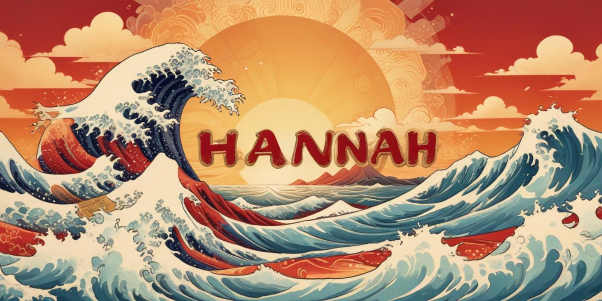

<picture>
 text-align: center
 <source media="(prefers-color-scheme: dark)" srcset="Hannah1.png">
 <source media="(prefers-color-scheme: light)" srcset="hannah2.jpeg">
 
</picture>

## Olá Githubers!👋

**Meu nome é Hannah**

- 👩🏽 Tenho 27 anos
- 🦕 Comecei a desenvolver em Cobol
- 🌱 Estou me aventurando em desenvolvimento FullStack e Cibersegurança
- 📫 Me encontre no linkedin: https://www.linkedin.com/in/hannah-vieira-brito/

---

## GitHub Stats

